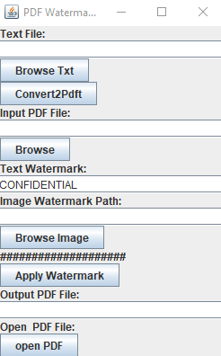

# **PDFWatermark**

**PDFWatermark** est un outil puissant pour personnaliser des fichiers PDF en ajoutant des éléments graphiques et textuels. Il prend en charge les filigranes, la signature électronique, et l'insertion d'images ou de textes.

---

## **Fonctionnalités principales**

### 1. Ajout de filigranes (watermark)
- Insérer une **image** (par exemple, une signature ou un logo) comme filigrane sur toutes les pages d’un fichier PDF.
- Ajouter du **texte personnalisé** comme "Confidentiel", avec des options de position, transparence et rotation.

### 2. Création de PDF à partir de texte
- Générer un **PDF** à partir d’un fichier texte brut ou d’autres formats (par exemple `.docx`).
- Ajouter des textes et images directement dans des zones spécifiques.

### 3. Ajout d’images
- **Positionner une image** (ex. : logo, signature) sur une ou plusieurs pages.
- **Redimensionner** l’image avant insertion pour l’adapter au document.

### 4. Personnalisation avancée
- Définir la **police**, la taille et la couleur des textes ajoutés.
- Configurer la **transparence**, l’angle et la position des éléments graphiques.

---

## **Cas d’utilisation typiques**
- **Signatures électroniques** : Ajouter une signature ou un logo sur un PDF.
- **Confidentialité** : Appliquer un filigrane "Confidentiel" pour protéger les documents sensibles.
- **Rapports personnalisés** : Ajouter des annotations, graphiques, ou logos sur des rapports PDF.

---

## **Exemple de flux d'utilisation**

1. **Étape 1** : Charger un fichier PDF existant.
2. **Étape 2** : Choisir le type de filigrane :
   - **Pour un texte** : Définir le contenu, la position, l'angle, la police et la transparence.
   - **Pour une image** : Fournir l'image, redimensionner et positionner.
3. **Étape 3** : Ajouter des signatures ou des images sur des pages spécifiques.
4. **Étape 4** : Sauvegarder le PDF avec les modifications.

---

## **Exemples de configuration**

### Filigrane texte
- **Texte** : `Confidentiel`  
- **Position** : Centre de la page  
- **Transparence** : 50%  
- **Angle** : 45°  

### Signature électronique
- **Image** : `signature.png`  
- **Page** : Dernière page uniquement  
- **Position** : Bas à droite  

---

### **Besoin d'aide pour le développement ?**
Je peux fournir une base de code en Python avec des bibliothèques comme `PyPDF2`, `FPDF`, ou `ReportLab` pour vous aider à créer votre propre outil **PDFWatermark**. 😊
